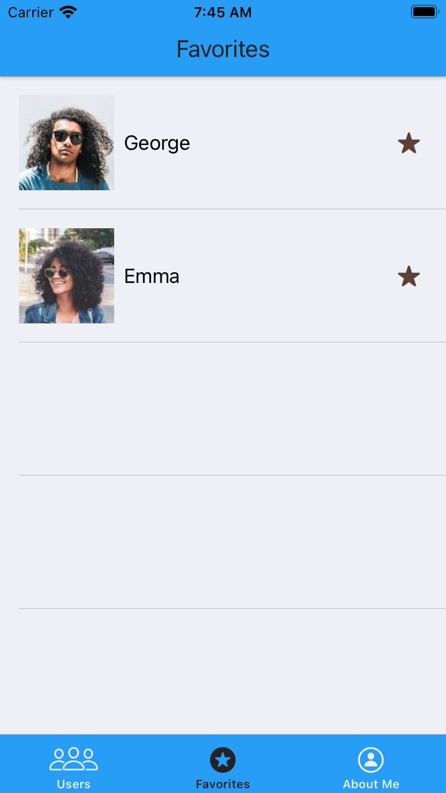

# Users App - App to IOS

    <table>
        <tr>
            <td></td>
            <td></td>
            <td></td>
            <td></td>
        </tr>
        <tr>
            <td></td>
            <td></td>
            <td></td>
        </tr>
    </table>

  

## Description
- The application has 4 main screens: Users, Favorites, About me and details screen, which can be accessed by clicking on any user. (O aplicativo possui 4 telas principais: Usuarios, Favoritos, Sobre mim e tela de detalhes, a qual pode ser acessada clicando em qualquer usuário.)

- On the Users screen, we list the users registered in the API in a table view. Furthermore, we use Kingfisher to load the cell images asynchronously and cached. (Na tela de Usuários, listamos os usuários cadastrados na API em uma table view. Além disso, usamos Kingfisher para carregar as imagens das células de forma assíncrona e cacheada.)

- On the About Me screen there is a scroll view to enable the visualization of all items. (Na tela de Sobre mim há uma scroll view para possibilitar a visualizacao de todos os itens.)

- On the Favorites screen, favorite users that are persisted through Core Data are displayed. We made the Core Data class as a singleton, so that it was instantiated only once and used by the Users and Favorites screen. (Na tela de Favoritos, são exibidos os usuários favoritados que são persistidos por meio do Core Data. Fizemos a classe do Core Data como um singleton, para que fosse instanciado apenas uma vez e utilizado pela tela de Usuários e de Favoritos.)

- As it was possible to bookmark from both screens, we used a delegate inside the Core Data class to notify both ViewModels that there was a change, and the “little star” of favorites should be updated. (Como era possível favoritar de ambas as telas, utilizamos um delegate dentro da classe do Core Data para notificar ambas as ViewModels de que houve uma alteração, e a “estrelinha” de favoritos deveria ser atualizada.)

- API requests were made using Alamofire. And to conform our Model with JSON, we use Coding Keys. (As requisições da API foram realizadas utilizando Alamofire. E para conformar nosso Model com o JSON, utilizamos Coding Keys.)

## Principais Tecnologias
- Swift and UIKit
- MVVM Architechture
- Cocoapods dependency manager
- Alamofire, Kingfisher, Snapkit, Quick and Nimble
- Uniting Tests

## Getting Started
1. Download or clone this repository; (Faça o download ou clone este repositório;)
1. Open your Terminal/Prompt and navigate to the UsersApp directory; (Abra seu Terminal/Prompt e navegue até o diretório UsersApp;)
1. Run: pod install; (Rode: pod install;)
1. Open the generated file UsersApp.xcworkspace; (Abra o arquivo gerado UsersApp.xcworkspace;)